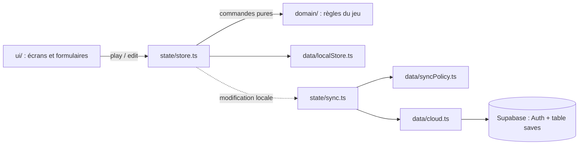
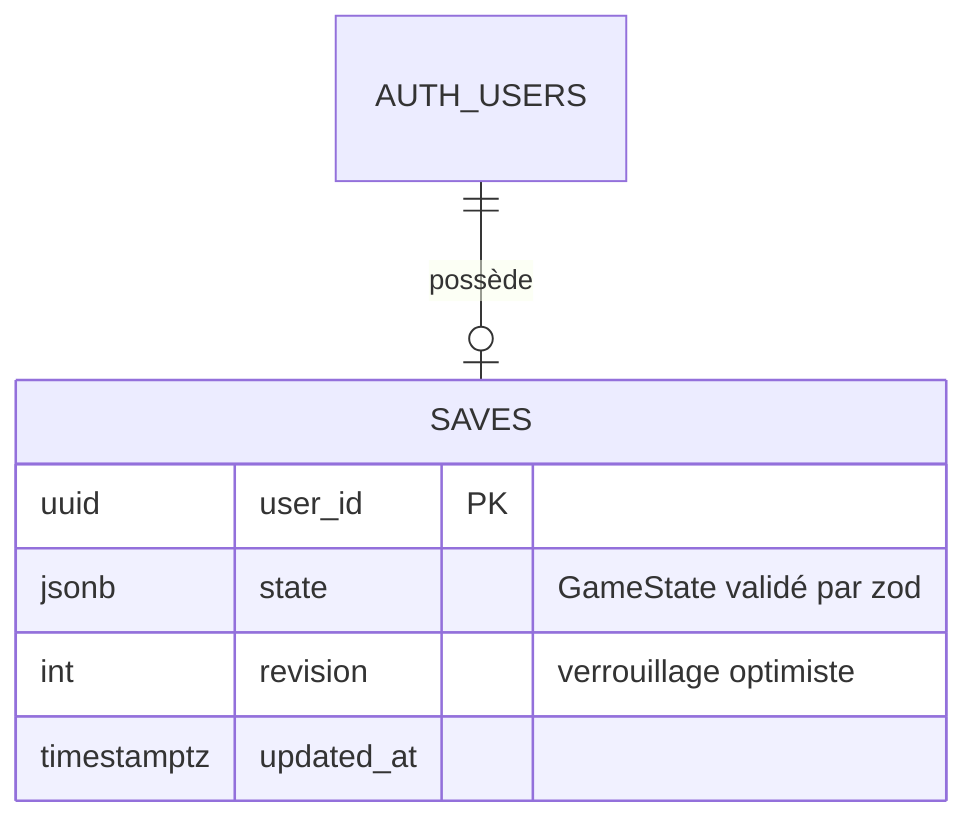

# Architecture de LifeQuest

Ce document retrace la conception de la V2 : besoin, produit, choix techniques et organisation du code.

## 1. Découverte

| | |
|---|---|
| **Problème** | Tenir ses habitudes et ses objectifs demande une motivation qui s'érode ; un jeu donne un retour immédiat et des conséquences. |
| **Utilisateur** | Un étudiant qui veut structurer sa vie (sport, révisions, budget, social), surtout sur téléphone. |
| **Objectif mesurable** | Ouvrir l'app chaque jour et valider ses quotidiennes ; série de 7 jours atteinte dans le premier mois. |
| **Contraintes** | Projet perso, budget nul, un seul développeur, hébergement gratuit (GitHub Pages). |
| **Volume** | 1 à quelques dizaines de joueurs ; une partie pèse quelques dizaines de Ko. |
| **Évolutions envisagées** | Rappels/notifications, lien avec BudgetPro (dépenses → XP Richesse), module de révision (flashcards → XP Intelligence), défis entre amis. |

Décisions de l'utilisateur : synchronisation téléphone ↔ ordinateur avec un compte ; app installable sur téléphone ; dépôt public publié sur GitHub Pages.

## 2. Analyse produit

**Persona — Mouad, 20 ans, étudiant.** Veut réviser régulièrement, faire du sport et tenir son budget. Abandonne les applis d'habitudes après une semaine : rien ne se passe s'il saute un jour. Il veut que ses efforts « comptent » et que l'oubli ait un prix.

User stories du MVP :
- En tant que joueur, je veux cocher mes habitudes du jour afin de gagner de l'XP et faire grandir ma série.
- En tant que joueur, je veux perdre des PV quand j'oublie une habitude afin que l'oubli ait une conséquence.
- En tant que joueur, je veux découper un gros objectif en étapes (boss) afin de le voir avancer.
- En tant que joueur, je veux dépenser mon or en vraies récompenses afin de me faire plaisir sans culpabiliser.
- En tant que joueur, je veux retrouver ma partie sur mon téléphone et mon ordinateur afin de jouer partout.
- En tant que joueur, je veux installer l'app et l'utiliser sans réseau afin de l'ouvrir en un geste.

| MoSCoW | Fonctionnalités |
|---|---|
| **Must** | Quotidiennes, missions, XP/niveaux/stats, PV et passage au jour suivant, boss, boutique, sauvegarde locale, PWA hors ligne, compte + synchro, export/import |
| **Should** | Succès, quêtes bonus, journal, calendrier d'activité, mode pause, import des sauvegardes V1 |
| **Could** | Rappels, thème clair, statistiques détaillées |
| **Won't (V2)** | Social/classements, IA, intégration BudgetPro |

Roadmap : **V2.0** (cette version) → **V2.1** rappels quotidiens (notifications push) → **V2.2** pont BudgetPro → **V3** module de révision avec IA.

## 3. Choix techniques

| Catégorie | Choix | Justification | Alternative écartée |
|---|---|---|---|
| Interface | React 19 + Vite | SPA sans besoin de SEO, hébergée en fichiers statiques : un serveur de rendu n'apporterait rien | Next.js : SSR inutile et incompatible avec un hébergement statique simple |
| Langage | TypeScript strict | Les règles du jeu (XP, dates, dégâts) sont faciles à casser silencieusement ; le typage strict et `noUncheckedIndexedAccess` les protègent | JavaScript : la V1 a montré la fragilité des états non typés |
| État | Zustand | Un seul store, quelques actions : plus léger que Redux, plus explicite que du contexte React | Redux Toolkit : cérémonie inutile à cette taille |
| Validation | Zod | Import, stockage local et cloud sont des frontières de confiance ; un schéma unique les valide et vérifie à la compilation qu'il colle au type | Validation manuelle : oublis garantis à chaque évolution du modèle |
| Compte + base | Supabase (Auth OTP + Postgres + RLS) | Offre gratuite, auth sans mot de passe fournie, règles d'accès par ligne en SQL : aucun serveur à écrire ni à héberger | Firebase : règles de sécurité moins lisibles et données moins portables ; backend maison : un serveur à maintenir pour un projet solo |
| Stockage de la partie | Un document JSONB par joueur | La partie est lue et écrite d'un bloc par son seul propriétaire ; aucune requête ne la filtre de l'intérieur | Tables normalisées (quêtes, boss…) : synchronisation champ par champ bien plus complexe sans aucun besoin de requête |
| Hors ligne | vite-plugin-pwa (Workbox) | Génère service worker et manifeste à partir du build, mise à jour automatique | Service worker écrit à la main (V1) : cache à invalider soi-même |
| Avatars | Bibliothèque DiceBear embarquée | Génération dans le navigateur : hors ligne, compatible avec une CSP stricte, pseudo jamais envoyé à un tiers | API HTTP DiceBear (V1) : dépendance réseau et fuite du pseudo |
| Hébergement | GitHub Pages + Actions | Gratuit, déployé à chaque push sur `main` après les tests | Vercel / Cloudflare : un compte de plus pour le même résultat sur un site statique |

## 4. Organisation du code

| Module | Responsabilité |
|---|---|
| `domain/types.ts` | Modèle du jeu (GameState, Daily, Mission, Boss…) et événements |
| `domain/rules.ts` | Constantes d'équilibrage (XP, or, dégâts, rangs) |
| `domain/progression.ts` | Courbes de niveau, rangs, bonus de série |
| `domain/engine.ts` | Primitives communes : gain, retrait, journal, succès, horodatage |
| `domain/game.ts` | Commandes de jeu : cocher, attaquer, acheter, passer au jour suivant |
| `domain/editing.ts` | Création/modification du contenu avec validation des saisies |
| `domain/schema.ts` | Schéma Zod de la sauvegarde et migration des sauvegardes V1 |
| `data/localStore.ts` | Lecture/écriture localStorage, tolérante aux pannes |
| `data/cloud.ts` | Appels Supabase (auth, lecture/écriture de la sauvegarde) |
| `data/syncPolicy.ts` | Décision de synchro (envoyer, récupérer, conflit), pure et testée |
| `state/store.ts` | Applique les commandes, persiste, publie les messages |
| `state/sync.ts` | Enchaîne connexion, récupération, envoi et résolution de conflit |
| `ui/` | Présentation uniquement ; aucune règle de jeu |

Règle d'architecture, vérifiée par ESLint : `src/domain` n'importe ni React, ni Zustand, ni Supabase, et n'accède ni à `window`, ni à `localStorage`. Chaque commande reçoit une horloge (`Clock`) et renvoie `{ state, events }` sans modifier l'état reçu.

### Modèle de données

`GameState` contient : héros, XP, or, PV, XP par stat, quotidiennes, missions, boss, boutique, succès, journal (80 entrées max), activité par jour (120 jours max), compteurs, mode pause, dernier jour actif.

### Parcours principaux

1. **Valider une quête** : `ui` → `play(toggleDaily)` → le domaine calcule le gain, le niveau et les succès → le store enregistre l'état (localStorage, regroupé sur 400 ms) et affiche les messages → si connecté, un envoi au cloud est programmé 1,5 s plus tard.
2. **Ouvrir l'app un autre jour** : `startNewDay` applique les dégâts des quotidiennes ratées et des boss en retard (au plus 3 jours comptés), puis affiche le récapitulatif.
3. **Synchroniser** : lecture de la ligne `saves` → `decideSync` compare à la partie locale et à la dernière révision connue → envoi conditionnel (`update … where revision = base`), récupération, ou demande au joueur s'il y a conflit.

### Décisions d'architecture

- **Le local fait foi, le cloud suit.** L'app reste utilisable sans réseau ; la synchro est une réplication, jamais un prérequis.
- **Verrouillage optimiste plutôt que fusion.** Fusionner deux parties de jeu (XP, séries, or) n'a pas de sens métier ; on détecte la divergence par la révision et on laisse le joueur choisir. La partie écartée est gardée en secours (`lifequest:backup`).
- **Une partie toute neuve ne déclenche pas de conflit** : sur un nouvel appareil, la partie en ligne est reprise d'office.
- **Pas de serveur applicatif.** Toute la sécurité d'accès repose sur les règles RLS de Postgres, testables en SQL.

## 5. Interface

| Écran | Rôle principal |
|---|---|
| Accueil | Créer son héros (ou récupérer sa partie en ligne) |
| Quêtes | Cocher les quotidiennes et missions du jour |
| Boss | Faire avancer les gros objectifs |
| Boutique | Échanger son or contre des récompenses |
| Profil | Statistiques, succès, compte, réglages, sauvegarde |

Design system : fond violet nuit `#0E0B16`, cartes `#181425`, XP `#8B5CF6`, or `#FBBF24`, PV `#F43F5E`, une couleur par statistique ; police système ; rayons 16 px. Thème sombre unique, assumé (univers de jeu). Mobile d'abord (560 px max), barre d'onglets en bas, panneaux de formulaire qui montent du bas.

Accessibilité : contrastes AA sur les textes, focus visible, cases à cocher et groupes de choix annoncés avec leurs rôles ARIA, panneaux modaux qui gardent le focus et se ferment avec Échap, notifications en `aria-live`, animations coupées si `prefers-reduced-motion`.

## Dette technique assumée

- La synchronisation est testée par ses règles (`syncPolicy.test.ts`) mais pas contre un vrai projet Supabase dans la CI.
- Le dernier appareil qui modifie une partie déjà divergente doit trancher à la main : acceptable à l'échelle d'un joueur, à revoir pour des parties partagées.
- La suppression du compte d'authentification lui-même se fait depuis le tableau de bord Supabase (le client ne peut supprimer que la sauvegarde).
